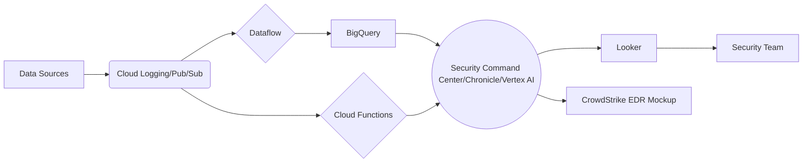

# GCP SIEM Architecture Design

## Overview

This document outlines the design for a comprehensive, scalable, and cost-effective AI-powered Security Information and Event Management (SIEM) architecture on Google Cloud's serverless infrastructure. The architecture is designed to meet the data residency requirements for Indonesia and integrate with a mockup for CrowdStrike EDR.

## Architecture Diagram

## Components

*   **Data Ingestion:**
    *   **Cloud Logging:** Collect logs from various sources (VMs, applications, network devices) within the Indonesia region.
    *   **Pub/Sub:** Ingest real-time security events and alerts into a central topic within the Indonesia region.
*   **Data Storage:**
    *   **BigQuery:** Store ingested logs and security events in a BigQuery dataset located in the Indonesia region. Use appropriate partitioning and clustering to optimize query performance and storage costs.
    *   **Cloud Storage:** Archive raw logs in Cloud Storage buckets located in the Indonesia region for long-term retention and compliance. Use different storage classes (e.g., Standard, Nearline, Coldline) based on access frequency to optimize costs.
*   **Data Processing:**
    *   **Dataflow:** Process and transform ingested data using Dataflow pipelines within the Indonesia region. Implement data enrichment, normalization, and aggregation logic.
    *   **Cloud Functions:** Trigger serverless functions to perform specific data processing tasks, such as threat intelligence lookups or anomaly detection, within the Indonesia region.
*   **Threat Detection:**
    *   **Security Command Center:** Leverage Security Command Center to identify and prioritize security risks across the Google Cloud environment in the Indonesia region.
    *   **Chronicle:** Ingest and analyze security telemetry from various sources using Chronicle's threat detection capabilities in the Indonesia region (if available).
    *   **AI/ML Models:** Develop and deploy custom AI/ML models in Vertex AI to detect anomalous behavior and potential threats based on historical data in the Indonesia region.
*   **Visualization and Reporting:**
    *   **Looker:** Visualize security data and generate reports using Looker dashboards connected to BigQuery in the Indonesia region.
*   **Integration:**
    *   **CrowdStrike EDR Mockup:** Develop a Cloud Function or Dataflow pipeline to simulate integration with CrowdStrike EDR. This mockup will receive alerts from the SIEM and trigger simulated responses.
    *   **Threat Intelligence Feeds:** Integrate with threat intelligence feeds by periodically fetching data and storing it in BigQuery for enrichment and correlation.

## Security Best Practices

*   **Least Privilege Access Control:** Implement IAM roles and policies to restrict access to Google Cloud resources based on the principle of least privilege.
*   **Encryption:** Enable encryption at rest for BigQuery datasets and Cloud Storage buckets. Use HTTPS for all data in transit.
*   **Security Audits:** Conduct regular security audits and penetration testing to identify and address potential vulnerabilities.

## Cost Optimization

*   **Storage Tiers:** Use appropriate storage tiers in Cloud Storage based on access frequency.
*   **Data Processing Optimization:** Optimize Dataflow pipelines to minimize processing time and resource consumption.
*   **Serverless Computing:** Leverage serverless computing with Cloud Functions and Dataflow to avoid paying for idle resources.
*   **BigQuery Optimization:** Use partitioning and clustering in BigQuery to optimize query performance and storage costs.

## Data Residency

All data will be stored and processed within the Indonesia region to comply with data residency requirements.

## Next Steps

Request a mode switch to implement the solution.